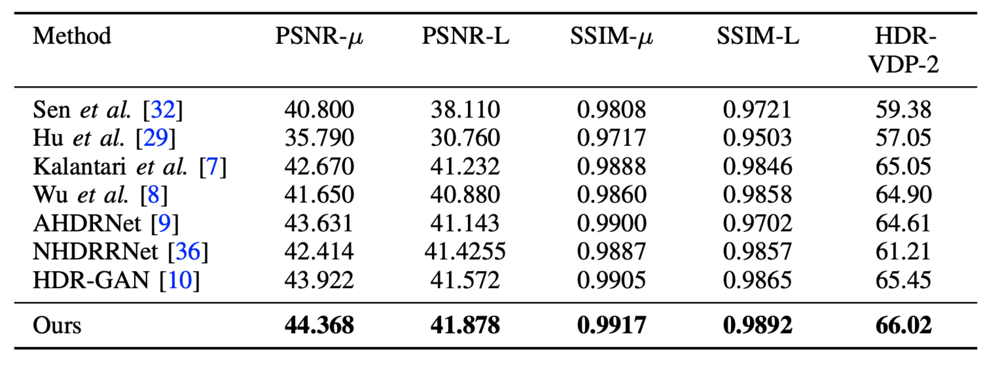
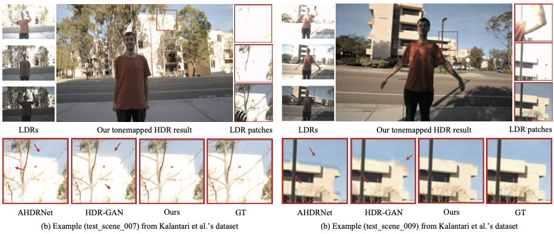

# ADNet: Attention-guided Deformable Convolutional Network for High Dynamic Range Imaging

By Zhen Liu<sup>1,2</sup>, Wenjie Lin<sup>1</sup>, Xinpeng Li<sup>1</sup>, Qing Rao<sup>1</sup>, Ting Jiang<sup>1</sup>, Mingyan Han<sup>1</sup>, [Haoqiang Fan](https://scholar.google.com.hk/citations?hl=zh-CN&user=bzzBut4AAAAJ)<sup>1</sup>, [Jian Sun](https://scholar.google.com.hk/citations?hl=zh-CN&user=ALVSZAYAAAAJ)<sup>1</sup> and [Shuaicheng Liu](http://www.liushuaicheng.org/)<sup>3,1*</sup>

<sup>1</sup>Megvii Technology, <sup>2</sup>Sichuan University, <sup>3</sup>University of Electronic Science and Technology of China

This is the official Pytorch implementation of *ADNet: Attention-guided Deformable Convolutional Network for High Dynamic Range Imaging*. 

[arXiv](https://arxiv.org/abs/2105.10697)


## News

Sep 24, 2021. We update the result on [Kalantari et al.'s dataset](https://people.engr.tamu.edu/nimak/Data/SIGGRAPH17_HDR_LoRes.pdf).






## Introduction

In this paper, we present an attention-guided deformable convolutional network for hand-held multi-frame high dynamic range (HDR) imaging, namely ADNet. This problem comprises two intractable challenges of how to handle saturation and noise properly and how to tackle misalignments caused by object motion or camera jittering. To address the former, we adopt a spatial attention module to adaptively select the most appropriate regions of various exposure low dynamic range (LDR) images for fusion. For the latter one, we propose to align the gamma-corrected images in the feature-level with a Pyramid, Cascading and Deformable (PCD) alignment module. The proposed ADNet shows state-of-the-art performance compared with previous methods, achieving a PSNR-l of 39.4471 and a PSNR-µ of 37.6359 in NTIRE 2021 Multi-Frame HDR Challenge.


## Usage

### Requirements

* Python 3.7.0
* Pytorch 1.2.0
* torchvision 0.4.0
* CUDA 10.0 on Ubuntu 18.04

1. Install python environment

   ```
   conda create -n adnet python=3.7
   conda activate adnet
   pip install -r requirement.txt
   ```

2. Build [DCN](https://github.com/CharlesShang/DCNv2) for `PCD` module

```
cd DCN_v2
./make.sh    # build dcn
python testcuda.py # run examples and gradient check on gpu
```

### Dataset

Download the dataset from [NTIRE2021 HDR Challenge](https://competitions.codalab.org/competitions/28162). To training our model, we first crop the training images to size 256x256 patches with a stride of 128.

### Training

```
python train.py
```

## Acknowledgement

Part of our codes are adapted from [AHDRNet](https://arxiv.org/abs/1904.10293) and [EDVR](https://arxiv.org/abs/1905.02716?utm_source=feedburner&utm_medium=feed&utm_campaign=Feed%253A+arxiv%252FQSXk+%2528ExcitingAds%2521+cs+updates+on+arXiv.org%2529) we thank the authors for their contributions.

## BibTex

```
@inproceedings{liu2021adnet,
  title={ADNet: Attention-guided deformable convolutional network for high dynamic range imaging},
  author={Liu, Zhen and Lin, Wenjie and Li, Xinpeng and Rao, Qing and Jiang, Ting and Han, Mingyan and Fan, Haoqiang and Sun, Jian and Liu, Shuaicheng},
  booktitle={CVPRW},
  pages={463--470},
  year={2021}
}
```

