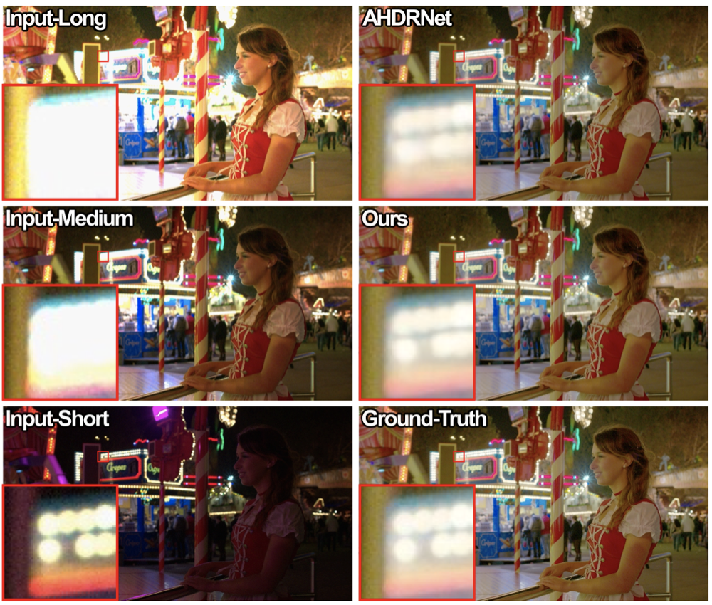
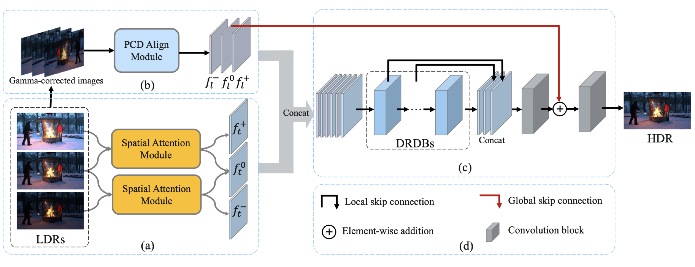

# ADNet: Attention-guided Deformable Convolutional Network for High Dynamic Range Imaging

By Zhen Liu1,2, Wenjie Lin1, Xinpeng Li1, Qing Rao1, Ting Jiang1, Mingyan Han1, [Haoqiang Fan](https://scholar.google.com.hk/citations?hl=zh-CN&user=bzzBut4AAAAJ)1, [Jian Sun](https://scholar.google.com.hk/citations?hl=zh-CN&user=ALVSZAYAAAAJ)1 and [Shuaicheng Liu](http://www.liushuaicheng.org/)3,1*

1Megvii Technology, 2Sichuan University, 3University of Electronic Science and Technology of China

This is the official Pytorch implementation of *ADNet: Attention-guided Deformable Convolutional Network for High Dynamic Range Imaging*. (Code will be released soon...)

## Introduction
In this paper, we present an attention-guided deformable convolutional network for hand-held multi-frame high dynamic range (HDR) imaging, namely ADNet. This problem comprises two intractable challenges of how to handle saturation and noise properly and how to tackle misalignments caused by object motion or camera jittering. To address the former, we adopt a spatial attention module to adaptively select the most appropriate regions of various exposure low dynamic range (LDR) images for fusion. For the latter one, we propose to align the gamma-corrected images in the feature-level with a Pyramid, Cascading and Deformable (PCD) alignment module. The proposed ADNet shows state-of-the-art performance compared with previous methods, achieving a PSNR-l of 39.4471 and a PSNRµ of 37.6359 in NTIRE 2021 Multi-Frame HDR Challenge.

